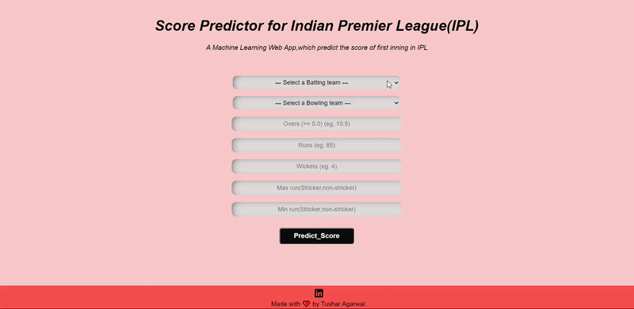

# Ipl-Score-Prediction-Deployment
- This repository consist of all the files required for the deployment of my project i.e **Ipl-Score-Prediction** you can check out my project [Here](https://github.com/tushar176/IPL-Score-Prediction).
- It is a **Machine Learning Web App** created Using **Flask** and deployed on **Heroku platform**.
- The link for the app is-->https://predicting-ipl-scores.herokuapp.com/

## Input Required(Features Used)
- **batting team**: Batting team name.
- **bowling_team**: Bowling team name.
- **runs**: Runs scored by team till that point of instance.
- **wickets**: Number of Wickets fallen of the team till that point of instance.
- **overs**: Number of Overs bowled till that point of instance.
- **striker**: max(runs scored by striker, runs scored by non-striker).
- **non-striker**: min(runs scored by striker, runs scored by non-striker).

## Demo
 

**Give a ⭐ if you like it or if this repository helped you in any way.**

**Thank You..**
